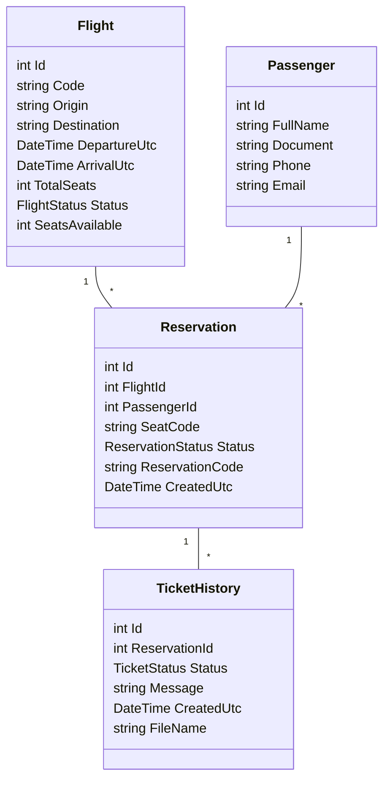

```mermaid
usecaseDiagram
  actor Admin as "Administrador"
  actor User as "Usuario"

  Admin --> (Registrar/Editar Vuelos)
  Admin --> (Cambiar Estado del Vuelo)
  Admin --> (Listar Vuelos)

  User --> (Registrar Pasajero)
  User --> (Editar Pasajero)
  User --> (Listar Pasajeros)

  User --> (Crear Reserva)
  User --> (Cancelar Reserva)
  User --> (Completar Reserva)
  User --> (Generar Ticket PDF)
```
